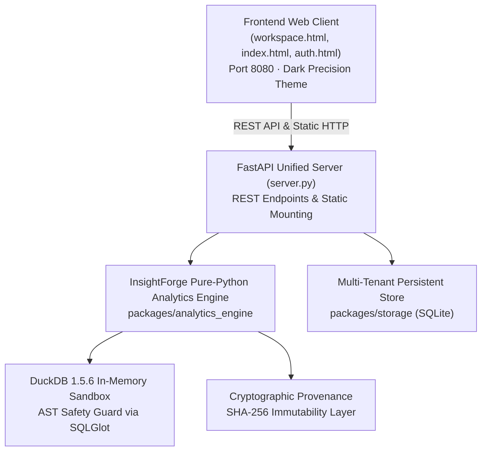

# InsightForge ⚡
### Automated Data Analytics & Business Intelligence Platform
*Mathematical Truth Over Generative Guesswork*

[](https://www.python.org/)
[](https://duckdb.org/)
[](https://fastapi.tiangolo.com/)
[](https://opensource.org/licenses/MIT)
[](#golden-cross-engine-parity)

InsightForge is an **automated data analytics and business intelligence platform** designed for enterprise analysts, finance teams, and business leadership. Unlike standard generative BI assistants that guess statistics or hallucinate numbers, InsightForge executes a **pure-Python and in-memory DuckDB calculation engine** first.

Every metric, chart, and analytical statement is deterministically calculated and tied to an immutable cryptographic dataset hash via an interactive **720px Slide-out Evidence Drawer**.

---

## 🏛️ System Architecture



---

## 🚀 The 10-Stage Automated Pipeline

When you load or upload a transaction dataset, InsightForge executes a deterministic 10-stage lifecycle:

```
[1. Ingest & SHA-256] ➔ [2. 4D Quality Audit] ➔ [3. Clean & Audit Trail] ➔ [4. Schema Mapping]
         ⬇
[5. EDA & Correlations] ➔ [6. RFM Segmentation] ➔ [7. Product Pareto 80/20] 
         ⬇
[8. Deterministic Insights] ➔ [9. Power BI Star Schema & DAX] ➔ [10. Executive Deck & Reports]
```

1. **Ingestion & Provenance:** Sniffs delimiters (`,`, `;`, `\t`) and character encodings (`utf-8`, `latin1`). Computes an immutable SHA-256 cryptographic hash of raw data.
2. **4D Data Quality Profiling:** Evaluates Completeness (30%), Uniqueness (25%), Validity (25%), and Consistency (20%). Classifies statistical outliers via Tukey's IQR and Z-score methods.
3. **Automated Cleaning Pipeline:** Deduplicates identical transactions, standardizes timestamps to ISO-8601, trims whitespace, and imputes null values using robust medians/modes while recording every step in an **Audit Trail**.
4. **Semantic Schema Mapping:** Heuristically detects business roles (`TRANSACTION_DATE`, `CUSTOMER_ID`, `REVENUE`, `QUANTITY`, `CATEGORY`, `PAYMENT_METHOD`) with confidence scores.
5. **Exploratory Data Analysis (EDA):** Generates univariate statistics (mean, std, min, quantiles, skewness), histograms, category revenue contributions, and a Pearson correlation matrix with strict *"association $\neq$ causation"* disclaimers.
6. **Customer RFM Segmentation:** Evaluates Recency, Frequency, and Monetary scores on a 1–5 quintile scale. Maps customers into a 5×5 matrix and 4 deterministic cohorts: *High Value (Champions)*, *Regular*, *Occasional*, and *At Risk*.
7. **Product & Basket Analytics:** Identifies core catalog velocity using Pareto 80/20 cumulative revenue analysis and breaks down payment rail adoption (UPI vs Credit Card vs COD).
8. **Deterministic Insights Engine:** Synthesizes verified findings with `MetricRef` tags. Zero numbers are generated by language models.
9. **Kimball Star Schema & DAX Modeling:** Decomposes flat tables into a dimensional star schema (`fact_sales` + `dim_date`, `dim_customer`, `dim_product`, `dim_payment`, `dim_location`, `dim_discount_band`) and generates 10 production DAX measures.
10. **Executive Deliverables:** Generates downloadable Power BI ZIP packages, 14-page PDF briefs, Word documents, and 11-slide PowerPoint presentation decks with speaker notes.

---

## 🛠️ Key Capabilities & Interactive Features

### 🔍 720px Slide-out Evidence Drawer
Clicking the **"Evidence"** button on any KPI card slides open a 720px drawer displaying:
* Exact mathematical calculation formula.
* Underlying DuckDB SQL query.
* SHA-256 cryptographic provenance hash of the cleaned dataset version.
* 4-step lineage stepper tracing data from ingestion through transformation to presentation.

### ⚡ Read-Only DuckDB SQL Sandbox
* Executes sub-second analytical queries against in-memory Parquet data.
* AST safety validator powered by `sqlglot` rejects destructive commands (`DROP`, `DELETE`, `UPDATE`, `ALTER`, `CREATE`). Only read-only `SELECT` queries are executed.

### 📦 Multi-Format Deliverable Generation
* **Power BI Star Schema Package (`.zip`):** Ready-to-import bundle containing star schema CSV tables, Power Query M scripts (`Loaders.m`), 10 DAX measures (`Measures.dax`), custom dark theme (`theme.json`), and manifest (`manifest.json`).
* **Executive PDF Brief (`.pdf`):** Formal multi-page report built with ReportLab including KPI verification tables, quality breakdowns, and RFM matrices.
* **Executive Word Brief (`.docx`):** Styled Word document generated via `python-docx`.
* **Executive Slide Deck (`.pptx`):** 11-slide widescreen presentation deck with speaker notes generated via `python-pptx`.

---

## 💻 Quick Start & Running Locally

### 1. Prerequisites
* Python 3.10+ (Tested on Python 3.14)
* Modern web browser (Chrome, Edge, Firefox, Safari)

### 2. Installation
```bash
git clone https://github.com/SanskritiMisshra/InsightForge.git
cd InsightForge
pip install -r requirements.txt
```

### 3. Launching the Platform
Start the unified FastAPI server on Port 8080:
```bash
python server.py
```

### 4. Accessing the Application
* **Analytics Workspace:** [http://localhost:8080/workspace.html](http://localhost:8080/workspace.html)
* **3D Factory Landing Page:** [http://localhost:8080/](http://localhost:8080/)
* **Authentication Portal:** [http://localhost:8080/auth.html](http://localhost:8080/auth.html)
* **API Health Check:** [http://localhost:8080/api/v1/health](http://localhost:8080/api/v1/health)

*(Note: Port 3000 is strictly avoided. All assets and APIs are served through Port 8080).*

---

## 🧪 Golden Cross-Engine Parity Tests

To guarantee mathematical equality across all engines:
```bash
python tests/test_golden_parity.py
```
**Verification Guarantees:**
* Python Vectorized Sum == DuckDB SQL Query == DAX Reference Metric ($|\Delta| < 0.001$).
* Distinct Orders, Customers, and AOV match with zero discrepancy.
* 4D Data Quality invariant formula holds: $0.30 \times \text{Comp} + 0.25 \times \text{Uniq} + 0.25 \times \text{Valid} + 0.20 \times \text{Cons} = 99/100$.

---

## 📚 Specification Documentation Index

The `Docs/` directory contains complete architectural specifications:

| Document | Purpose |
| :--- | :--- |
| [PRD.md](Docs/PRD.md) | Master Product Requirements & Core Philosophy |
| [DESIGN.md](Docs/DESIGN.md) | Precision Dark UX/UI Design System & Tokens |
| [ARCHITECTURE.md](Docs/ARCHITECTURE.md) | Monorepo Topology, Engine Design & Data Pipelines |
| [DATABASE.md](Docs/DATABASE.md) | PostgreSQL 16 Schema, UUIDv7, Audit Triggers & DDL |
| [ANALYTICS_SPEC.md](Docs/ANALYTICS_SPEC.md) | Single Source of Mathematical Truth for All Metrics |
| [API_SPEC.md](Docs/API_SPEC.md) | OpenAPI 3.1 HTTP/SSE Resource & Endpoint Contracts |
| [SQL_SPEC.md](Docs/SQL_SPEC.md) | DuckDB In-Memory Sandbox, AST Security & Templates |
| [POWERBI_SPEC.md](Docs/POWERBI_SPEC.md) | Kimball Star Schema, 10 DAX Measures & M Loaders |
| [IMPLEMENTATION_PLAN.md](Docs/IMPLEMENTATION_PLAN.md) | 10-Phase Engineering Roadmap & Gap Analysis |
| [PROJECT_TRACKER.md](PROJECT_TRACKER.md) | Living Work Register & Backlog Status |

---

## 📄 License
This project is licensed under the MIT License.
